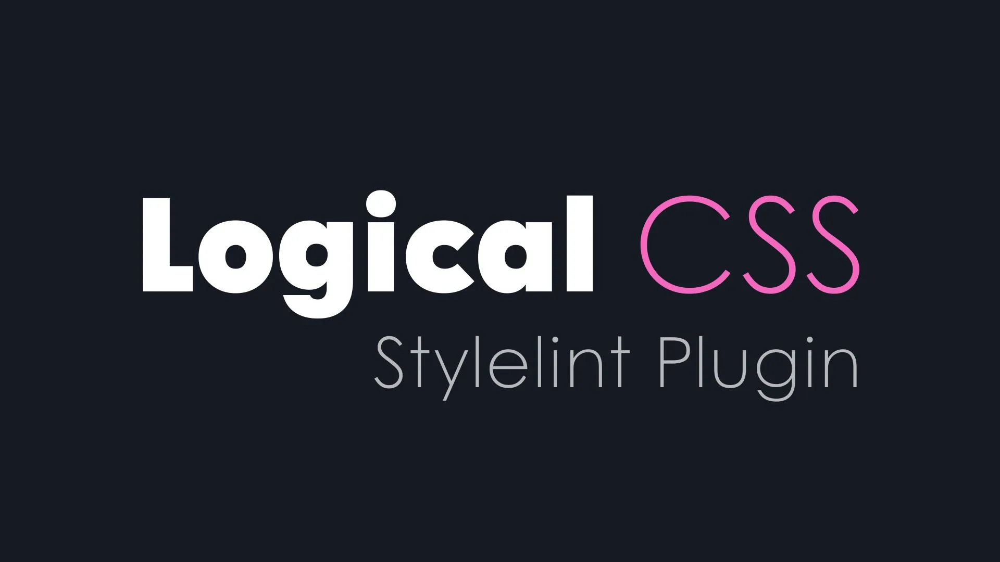

A Stylelint plugin to enforce the use of [logical CSS properties, values and units](https://developer.mozilla.org/en-US/docs/Web/CSS/CSS_Logical_Properties) for adaptive, i18n-first styles.

> [!TIP]
> [V1 documentation can be found here](./V1-DOCUMENTATION.md)

## Table of Contents

[Getting Started](#getting-started) | [Quickstart](#quickstart) | [Plugin Configs](#logical-css-configs) |  [Plugin Rules](#logical-css-rules) | [Troubleshooting](#troubleshooting)

## Getting Started

> [!IMPORTANT]
> The plugin requires [Stylelint](https://stylelint.io/) v14.0.0 or greater.

To get started using the plugin, it must first be installed.

```bash
npm i stylelint-plugin-logical-css --save-dev
```

```bash
yarn add stylelint-plugin-logical-css --dev
```

With the plugin installed, it must be added to the `plugins` array of your Stylelint config.

```json
{
  "plugins": ["stylelint-plugin-logical-css"],
}
```

After adding the plugin to the configuration file, you now have access to the various rules and options it provides.

## Quickstart

==> TODO

## Logical CSS Configs

==> TODO

## Logical CSS Rules

The plugin provides multiple rules that can be toggled on and off as needed.

1. [Require Logical Units](#require-logical-units)

---

### Require Logical Units

> [!NOTE]
> Read about current [browser support for logical CSS units](https://caniuse.com/mdn-css_types_length_viewport_percentage_units_dynamic).

Physical CSS units like `vh` (viewport height) and `vw` (viewport width) reference absolute dimensions that don't adapt to writing modes or text direction. Logical units like `vb` (viewport block) and `vi` (viewport inline) automatically adjust based on the document's writing mode, supporting internationalization and adaptive layouts.

**Enable this rule to:** Enforce the use of logical CSS units (`vb`, `vi`, `cqb`, `cqi`, etc.) over their physical equivalents (`vh`, `vw`, `cqh`, `cqw`, etc.), ensuring your styles adapt properly to different writing modes and text directions.

```json
{
  "rules": {
    "logical-css/require-logical-units": true,
  }
}
```

#### Require Logical Units Options

**Configuration:** By default, this rule validates all CSS properties for any use of physical units (`vh`, `vw`, `dvh`, `dvw`, `lvh`, `lvw`, `svh`, `svw`, `cqh`, `cqw`). Use the rule options to exclude specific physical units from validation, automate physical-to-logical unit fixing, or adjust the severity level as needed.

```ts
type Severity = 'error' | 'warning';

interface SecondaryOptions {
  'fix'?: boolean;
  'ignore'?: PhysicalUnit[],
  "severity"?: Severity 
}
```

```json
{
  "rules": {
    "logical-css/require-logical-units": [true, { 
      "fix": true,
      "ignore": ["vh", "dvw"],
      "severity": "error",
    }]
  }
}
```

#### Require Logical Units Map

The following table shows how physical CSS units are mapped to their logical equivalents. When this rule detects a physical unit, it will suggest (or automatically fix, if enabled) the corresponding logical unit.

<details>
<summary>🚀 View Physical to Logical Unit Mappings</summary>

<table>
  <thead>
    <tr>
      <th>Physical Unit</th>
      <th>Logical Unit</th>
      <th>Description</th>
    </tr>
  </thead>
  <tbody>
    <tr>
      <td><code>vh</code></td>
      <td><code>vb</code></td>
      <td>Viewport height → Viewport block</td>
    </tr>
    <tr>
      <td><code>vw</code></td>
      <td><code>vi</code></td>
      <td>Viewport width → Viewport inline</td>
    </tr>
    <tr>
      <td><code>dvh</code></td>
      <td><code>dvb</code></td>
      <td>Dynamic viewport height → Dynamic viewport block</td>
    </tr>
    <tr>
      <td><code>dvw</code></td>
      <td><code>dvi</code></td>
      <td>Dynamic viewport width → Dynamic viewport inline</td>
    </tr>
    <tr>
      <td><code>lvh</code></td>
      <td><code>lvb</code></td>
      <td>Large viewport height → Large viewport block</td>
    </tr>
    <tr>
      <td><code>lvw</code></td>
      <td><code>lvi</code></td>
      <td>Large viewport width → Large viewport inline</td>
    </tr>
    <tr>
      <td><code>svh</code></td>
      <td><code>svb</code></td>
      <td>Small viewport height → Small viewport block</td>
    </tr>
    <tr>
      <td><code>svw</code></td>
      <td><code>svi</code></td>
      <td>Small viewport width → Small viewport inline</td>
    </tr>
    <tr>
      <td><code>cqh</code></td>
      <td><code>cqb</code></td>
      <td>Container query height → Container query block</td>
    </tr>
    <tr>
      <td><code>cqw</code></td>
      <td><code>cqi</code></td>
      <td>Container query width → Container query inline</td>
    </tr>
  </tbody>
</table>

</details>

#### Require Logical Units Examples

<details>
<summary>✅ Passing Examples</summary>

```css
.element {
  block-size: 100vb;
  inline-size: 80vi;
}

.card {
  max-block-size: 50cqb;
  max-inline-size: 100cqi;
}

.hero {
  min-block-size: 100dvb;
  inline-size: min(80vi, 100%);
}

.responsive {
  inline-size: clamp(20vi, 50%, 80vi);
}
```

</details>

<details>
<summary>❌ Failing Examples</summary>

```css
.element {
  height: 100vh;
  width: 80vw;
}

.card {
  max-height: 50cqh;
  max-width: 100cqw;
}

.hero {
  min-height: 100dvh;
  width: min(80vw, 100%);
}

.responsive {
  width: clamp(20vw, 50%, 80vw);
}

.partial {
  width: 50.5vw;
}
```

</details>

---

## Troubleshooting

==> TODO
