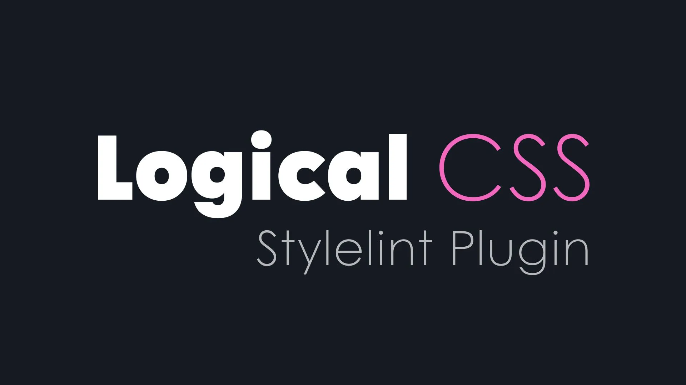

A Stylelint plugin to enforce the use of [logical CSS properties, values and units](https://developer.mozilla.org/en-US/docs/Web/CSS/CSS_Logical_Properties) for adaptive, i18n-first styles.

> [!TIP]
> [V1 documentation can be found here](./V1-DOCUMENTATION.md)

## Table of Contents

[Getting Started](#getting-started) | [Quickstart](#quickstart) | [Plugin Configs](#logical-css-configs) | [Plugin Rules](#logical-css-rules) | [Troubleshooting](#troubleshooting) | [Upgrading from 1.x → 2.x](#upgrading-from-1x--2x)

## Getting Started

> [!IMPORTANT]
> The plugin requires [Stylelint](https://stylelint.io/) v14.0.0 or greater.

To get started using the plugin, it must first be installed.

```bash
npm i stylelint-plugin-logical-css --save-dev
```

```bash
yarn add stylelint-plugin-logical-css --dev
```

With the plugin installed, it must be added to the `plugins` array of your Stylelint config.

```json
{
  "plugins": ["stylelint-plugin-logical-css"],
}
```

After adding the plugin to the configuration file, you now have access to the various rules and options it provides.

## Quickstart

After installation, add this to your `.stylelintrc.json`:

```json
{
  "plugins": ["stylelint-plugin-logical-css"],
  "extends": ["stylelint-plugin-logical-css/configs/recommended"]
}
```

## Logical CSS Configs

For quick setup, the plugin provides preset configurations that enable commonly used rules.

### Recommended

The `recommended` preset enables core logical CSS rules with sensible defaults, suitable for most projects.

**Usage:**

```json
{
  "extends": ["stylelint-plugin-logical-css/configs/recommended"]
}
```

**Equivalent to:**

```json
{
  "plugins": ["stylelint-plugin-logical-css"],
  "rules": {
    "logical-css/require-logical-keywords": [
      true,
      { "ignore": ["caption-side", "offset-anchor", "offset-position"], "severity": "error" },
    ],
    "logical-css/require-logical-properties": [true, { "severity": "error" }],
    "logical-css/require-logical-units": [true, { "severity": "error" }],
  },
}
```

## Logical CSS Rules

The plugin provides multiple rules that can be toggled on and off as needed.

1. [Require Logical Keywords](#require-logical-keywords)
2. [Require Logical Properties](#require-logical-properties)
3. [Require Logical Units](#require-logical-units)

---

### Require Logical Keywords

> [!NOTE]
> Read about current [browser support for logical CSS properties](https://developer.mozilla.org/en-US/docs/Web/CSS/CSS_Logical_Properties).

Physical CSS directional keywords like `left`, `right`, `top`, `bottom`, `horizontal`, and `vertical` reference absolute directions that don't adapt to writing modes or text direction. Logical keywords like `start`, `end`, `inline-start`, `block-end`, `inline`, and `block` automatically adjust based on the document's writing mode, supporting internationalization and adaptive layouts.

**Enable this rule to:** Enforce the use of logical CSS directional keywords (`start`, `end`, `inline-start`, `block-end`, `inline`, `block`, etc.) over their physical equivalents (`left`, `right`, `top`, `bottom`, `horizontal`, `vertical`) in property values, ensuring your styles adapt properly to different writing modes and text directions.

```json
{
  "rules": {
    "logical-css/require-logical-keywords": true,
  }
}
```

#### Require Logical Keywords Options

```ts
type Severity = 'error' | 'warning';

interface SecondaryOptions {
  fix?: boolean;
  ignore?: PhysicalKeywordProperty[],
  severity?: Severity
}
```

```json
{
  "rules": {
    "logical-css/require-logical-keywords": [true, {
      "fix": true,
      "ignore": ["caption-side", "offset-anchor"],
      "severity": "error",
    }]
  }
}
```

#### Require Logical Keywords Map

The following table shows how physical CSS directional keywords are mapped to their logical equivalents. When this rule detects a physical keyword, it will suggest (or automatically fix, if enabled) the corresponding logical keyword.

<details>
<summary>🚀 View Physical to Logical Keyword Mappings</summary>

<table>
  <thead>
    <tr>
      <th>Property</th>
      <th>Physical Keyword(s)</th>
      <th>Logical Keyword(s)</th>
    </tr>
  </thead>
  <tbody>
    <tr>
      <td><code>box-orient</code></td>
      <td><code>horizontal</code>, <code>vertical</code></td>
      <td><code>inline-axis</code>, <code>block-axis</code></td>
    </tr>
    <tr>
      <td><code>caption-side</code></td>
      <td><code>top</code>, <code>bottom</code>, <code>left</code>, <code>right</code></td>
      <td><code>block-start</code>, <code>block-end</code>, <code>inline-start</code>, <code>inline-end</code></td>
    </tr>
    <tr>
      <td><code>clear</code></td>
      <td><code>left</code>, <code>right</code></td>
      <td><code>inline-start</code>, <code>inline-end</code></td>
    </tr>
    <tr>
      <td><code>float</code></td>
      <td><code>left</code>, <code>right</code></td>
      <td><code>inline-start</code>, <code>inline-end</code></td>
    </tr>
    <tr>
      <td><code>offset-anchor</code></td>
      <td><code>top</code>, <code>bottom</code>, <code>left</code>, <code>right</code></td>
      <td><code>block-start</code>, <code>block-end</code>, <code>inline-start</code>, <code>inline-end</code></td>
    </tr>
    <tr>
      <td><code>offset-position</code></td>
      <td><code>top</code>, <code>bottom</code>, <code>left</code>, <code>right</code></td>
      <td><code>block-start</code>, <code>block-end</code>, <code>inline-start</code>, <code>inline-end</code></td>
    </tr>
    <tr>
      <td><code>resize</code></td>
      <td><code>horizontal</code>, <code>vertical</code></td>
      <td><code>inline</code>, <code>block</code></td>
    </tr>
    <tr>
      <td><code>text-align</code></td>
      <td><code>left</code>, <code>right</code></td>
      <td><code>start</code>, <code>end</code></td>
    </tr>
    <tr>
      <td><code>text-align-last</code></td>
      <td><code>left</code>, <code>right</code></td>
      <td><code>start</code>, <code>end</code></td>
    </tr>
  </tbody>
</table>

</details>

#### Require Logical Keywords Examples

<details>
<summary>✅ Passing Examples</summary>

```css
.text {
  text-align: start;
  text-align-last: end;
}

.layout {
  float: inline-start;
  clear: inline-end;
}

.box {
  resize: inline;
}

.table {
  caption-side: block-start;
}

.legacy {
  box-orient: inline-axis;
}

.positioned {
  offset-anchor: block-end inline-start;
  offset-position: block-start inline-end;
}
```

</details>

<details>
<summary>❌ Failing Examples</summary>

```css
.text {
  text-align: left;
  text-align-last: right;
}

.layout {
  float: left;
  clear: right;
}

.box {
  resize: horizontal;
}

.table {
  caption-side: top;
}

.legacy {
  box-orient: vertical;
}

.positioned {
  offset-anchor: bottom left;
  offset-position: top right;
}
```

</details>

---

### Require Logical Properties

> [!NOTE]
> Read about current [browser support for logical CSS properties](https://developer.mozilla.org/en-US/docs/Web/CSS/CSS_Logical_Properties).

Physical CSS properties like `width`, `height`, `left`, and `margin-top` reference absolute dimensions and directions that don't adapt to writing modes or text direction. Logical properties like `inline-size`, `block-size`, `inset-inline-start`, and `margin-block-start` automatically adjust based on the document's writing mode, supporting internationalization and adaptive layouts.

**Enable this rule to:** Enforce the use of logical CSS properties (`inline-size`, `block-size`, `margin-inline`, `padding-block`, etc.) over their physical equivalents (`width`, `height`, `margin-left`, `padding-top`, etc.), ensuring your styles adapt properly to different writing modes and text directions.

```json
{
  "rules": {
    "logical-css/require-logical-properties": true,
  }
}
```

#### Require Logical Properties Options

**Configuration:** By default, this rule validates all CSS declarations for any use of physical properties (`width`, `height`, `top`, `left`, `margin-left`, `padding-top`, etc.). Use the rule options to exclude specific physical properties from validation, automate physical-to-logical property fixing, or adjust the severity level as needed.

```ts
type Severity = 'error' | 'warning';

interface SecondaryOptions {
  fix?: boolean;
  ignore?: PhysicalProperty[],
  severity?: Severity
}
```

```json
{
  "rules": {
    "logical-css/require-logical-properties": [true, {
      "fix": true,
      "ignore": ["height", "scroll-margin-bottom", "width"],
      "severity": "error",
    }]
  }
}
```

#### Require Logical Properties Map

The following table shows how physical CSS properties are mapped to their logical equivalents. When this rule detects a physical property, it will suggest (or automatically fix, if enabled) the corresponding logical property.

<details>
<summary>🚀 View Physical to Logical Properties Mappings</summary>

<table>
  <thead>
    <tr>
      <th>Physical Property</th>
      <th>Logical Property</th>
      <th>Description</th>
    </tr>
  </thead>
  <tbody>
    <tr>
      <td><code>border-bottom</code></td>
      <td><code>border-block-end</code></td>
      <td>Bottom border → Block end border</td>
    </tr>
    <tr>
      <td><code>border-bottom-color</code></td>
      <td><code>border-block-end-color</code></td>
      <td>Bottom border color → Block end border color</td>
    </tr>
    <tr>
      <td><code>border-bottom-left-radius</code></td>
      <td><code>border-end-start-radius</code></td>
      <td>Bottom-left radius → End-start radius</td>
    </tr>
    <tr>
      <td><code>border-bottom-right-radius</code></td>
      <td><code>border-end-end-radius</code></td>
      <td>Bottom-right radius → End-end radius</td>
    </tr>
    <tr>
      <td><code>border-bottom-style</code></td>
      <td><code>border-block-end-style</code></td>
      <td>Bottom border style → Block end border style</td>
    </tr>
    <tr>
      <td><code>border-bottom-width</code></td>
      <td><code>border-block-end-width</code></td>
      <td>Bottom border width → Block end border width</td>
    </tr>
    <tr>
      <td><code>border-left</code></td>
      <td><code>border-inline-start</code></td>
      <td>Left border → Inline start border</td>
    </tr>
    <tr>
      <td><code>border-left-color</code></td>
      <td><code>border-inline-start-color</code></td>
      <td>Left border color → Inline start border color</td>
    </tr>
    <tr>
      <td><code>border-left-style</code></td>
      <td><code>border-inline-start-style</code></td>
      <td>Left border style → Inline start border style</td>
    </tr>
    <tr>
      <td><code>border-left-width</code></td>
      <td><code>border-inline-start-width</code></td>
      <td>Left border width → Inline start border width</td>
    </tr>
    <tr>
      <td><code>border-right</code></td>
      <td><code>border-inline-end</code></td>
      <td>Right border → Inline end border</td>
    </tr>
    <tr>
      <td><code>border-right-color</code></td>
      <td><code>border-inline-end-color</code></td>
      <td>Right border color → Inline end border color</td>
    </tr>
    <tr>
      <td><code>border-right-style</code></td>
      <td><code>border-inline-end-style</code></td>
      <td>Right border style → Inline end border style</td>
    </tr>
    <tr>
      <td><code>border-right-width</code></td>
      <td><code>border-inline-end-width</code></td>
      <td>Right border width → Inline end border width</td>
    </tr>
    <tr>
      <td><code>border-top</code></td>
      <td><code>border-block-start</code></td>
      <td>Top border → Block start border</td>
    </tr>
    <tr>
      <td><code>border-top-color</code></td>
      <td><code>border-block-start-color</code></td>
      <td>Top border color → Block start border color</td>
    </tr>
    <tr>
      <td><code>border-top-left-radius</code></td>
      <td><code>border-start-start-radius</code></td>
      <td>Top-left radius → Start-start radius</td>
    </tr>
    <tr>
      <td><code>border-top-right-radius</code></td>
      <td><code>border-start-end-radius</code></td>
      <td>Top-right radius → Start-end radius</td>
    </tr>
    <tr>
      <td><code>border-top-style</code></td>
      <td><code>border-block-start-style</code></td>
      <td>Top border style → Block start border style</td>
    </tr>
    <tr>
      <td><code>border-top-width</code></td>
      <td><code>border-block-start-width</code></td>
      <td>Top border width → Block start border width</td>
    </tr>
    <tr>
      <td><code>bottom</code></td>
      <td><code>inset-block-end</code></td>
      <td>Bottom position → Block end position</td>
    </tr>
    <tr>
      <td><code>contain-intrinsic-height</code></td>
      <td><code>contain-intrinsic-block-size</code></td>
      <td>Intrinsic height → Intrinsic block size</td>
    </tr>
    <tr>
      <td><code>contain-intrinsic-width</code></td>
      <td><code>contain-intrinsic-inline-size</code></td>
      <td>Intrinsic width → Intrinsic inline size</td>
    </tr>
    <tr>
      <td><code>height</code></td>
      <td><code>block-size</code></td>
      <td>Height → Block size</td>
    </tr>
    <tr>
      <td><code>left</code></td>
      <td><code>inset-inline-start</code></td>
      <td>Left position → Inline start position</td>
    </tr>
    <tr>
      <td><code>margin-bottom</code></td>
      <td><code>margin-block-end</code></td>
      <td>Bottom margin → Block end margin</td>
    </tr>
    <tr>
      <td><code>margin-left</code></td>
      <td><code>margin-inline-start</code></td>
      <td>Left margin → Inline start margin</td>
    </tr>
    <tr>
      <td><code>margin-right</code></td>
      <td><code>margin-inline-end</code></td>
      <td>Right margin → Inline end margin</td>
    </tr>
    <tr>
      <td><code>margin-top</code></td>
      <td><code>margin-block-start</code></td>
      <td>Top margin → Block start margin</td>
    </tr>
    <tr>
      <td><code>max-height</code></td>
      <td><code>max-block-size</code></td>
      <td>Maximum height → Maximum block size</td>
    </tr>
    <tr>
      <td><code>max-width</code></td>
      <td><code>max-inline-size</code></td>
      <td>Maximum width → Maximum inline size</td>
    </tr>
    <tr>
      <td><code>min-height</code></td>
      <td><code>min-block-size</code></td>
      <td>Minimum height → Minimum block size</td>
    </tr>
    <tr>
      <td><code>min-width</code></td>
      <td><code>min-inline-size</code></td>
      <td>Minimum width → Minimum inline size</td>
    </tr>
    <tr>
      <td><code>overflow-x</code></td>
      <td><code>overflow-inline</code></td>
      <td>Horizontal overflow → Inline overflow</td>
    </tr>
    <tr>
      <td><code>overflow-y</code></td>
      <td><code>overflow-block</code></td>
      <td>Vertical overflow → Block overflow</td>
    </tr>
    <tr>
      <td><code>overscroll-behavior-x</code></td>
      <td><code>overscroll-behavior-inline</code></td>
      <td>Horizontal overscroll → Inline overscroll</td>
    </tr>
    <tr>
      <td><code>overscroll-behavior-y</code></td>
      <td><code>overscroll-behavior-block</code></td>
      <td>Vertical overscroll → Block overscroll</td>
    </tr>
    <tr>
      <td><code>padding-bottom</code></td>
      <td><code>padding-block-end</code></td>
      <td>Bottom padding → Block end padding</td>
    </tr>
    <tr>
      <td><code>padding-left</code></td>
      <td><code>padding-inline-start</code></td>
      <td>Left padding → Inline start padding</td>
    </tr>
    <tr>
      <td><code>padding-right</code></td>
      <td><code>padding-inline-end</code></td>
      <td>Right padding → Inline end padding</td>
    </tr>
    <tr>
      <td><code>padding-top</code></td>
      <td><code>padding-block-start</code></td>
      <td>Top padding → Block start padding</td>
    </tr>
    <tr>
      <td><code>right</code></td>
      <td><code>inset-inline-end</code></td>
      <td>Right position → Inline end position</td>
    </tr>
    <tr>
      <td><code>scroll-margin-bottom</code></td>
      <td><code>scroll-margin-block-end</code></td>
      <td>Bottom scroll margin → Block end scroll margin</td>
    </tr>
    <tr>
      <td><code>scroll-margin-left</code></td>
      <td><code>scroll-margin-inline-start</code></td>
      <td>Left scroll margin → Inline start scroll margin</td>
    </tr>
    <tr>
      <td><code>scroll-margin-right</code></td>
      <td><code>scroll-margin-inline-end</code></td>
      <td>Right scroll margin → Inline end scroll margin</td>
    </tr>
    <tr>
      <td><code>scroll-margin-top</code></td>
      <td><code>scroll-margin-block-start</code></td>
      <td>Top scroll margin → Block start scroll margin</td>
    </tr>
    <tr>
      <td><code>scroll-padding-bottom</code></td>
      <td><code>scroll-padding-block-end</code></td>
      <td>Bottom scroll padding → Block end scroll padding</td>
    </tr>
    <tr>
      <td><code>scroll-padding-left</code></td>
      <td><code>scroll-padding-inline-start</code></td>
      <td>Left scroll padding → Inline start scroll padding</td>
    </tr>
    <tr>
      <td><code>scroll-padding-right</code></td>
      <td><code>scroll-padding-inline-end</code></td>
      <td>Right scroll padding → Inline end scroll padding</td>
    </tr>
    <tr>
      <td><code>scroll-padding-top</code></td>
      <td><code>scroll-padding-block-start</code></td>
      <td>Top scroll padding → Block start scroll padding</td>
    </tr>
    <tr>
      <td><code>top</code></td>
      <td><code>inset-block-start</code></td>
      <td>Top position → Block start position</td>
    </tr>
    <tr>
      <td><code>width</code></td>
      <td><code>inline-size</code></td>
      <td>Width → Inline size</td>
    </tr>
  </tbody>
</table>
</details>

#### Require Logical Properties Examples

<details>
<summary>✅ Passing Examples</summary>

```css
.element {
  inline-size: 100%;
  block-size: 50vh;
}

.box {
  margin-block-start: 1rem;
  margin-inline: 2rem;
  padding-block: 10px;
  padding-inline-end: 20px;
}

.positioned {
  inset-inline-start: 0;
  inset-block-end: 10px;
}

.borders {
  border-inline-start: 1px solid black;
  border-block-end-color: red;
  border-start-start-radius: 8px;
}
```

</details>

<details>
<summary>❌ Failing Examples</summary>

```css
.element {
  width: 100%;
  height: 50vh;
}

.box {
  margin-top: 1rem;
  margin-left: 2rem;
  margin-right: 2rem;
  padding-top: 10px;
  padding-bottom: 10px;
  padding-right: 20px;
}

.positioned {
  left: 0;
  bottom: 10px;
}

.borders {
  border-left: 1px solid black;
  border-bottom-color: red;
  border-top-left-radius: 8px;
}
```

</details>

---

### Require Logical Units

> [!NOTE]
> Read about current [browser support for logical CSS units](https://caniuse.com/mdn-css_types_length_viewport_percentage_units_dynamic).

Physical CSS units like `vh` (viewport height) and `vw` (viewport width) reference absolute dimensions that don't adapt to writing modes or text direction. Logical units like `vb` (viewport block) and `vi` (viewport inline) automatically adjust based on the document's writing mode, supporting internationalization and adaptive layouts.

**Enable this rule to:** Enforce the use of logical CSS units (`vb`, `vi`, `cqb`, `cqi`, etc.) over their physical equivalents (`vh`, `vw`, `cqh`, `cqw`, etc.), ensuring your styles adapt properly to different writing modes and text directions.

```json
{
  "rules": {
    "logical-css/require-logical-units": true,
  }
}
```

#### Require Logical Units Options

**Configuration:** By default, this rule validates all CSS properties for any use of physical units (`vh`, `vw`, `dvh`, `dvw`, `lvh`, `lvw`, `svh`, `svw`, `cqh`, `cqw`). Use the rule options to exclude specific physical units from validation, automate physical-to-logical unit fixing, or adjust the severity level as needed.

```ts
type Severity = 'error' | 'warning';

interface SecondaryOptions {
  fix?: boolean;
  ignore?: PhysicalUnit[],
  severity?: Severity
}
```

```json
{
  "rules": {
    "logical-css/require-logical-units": [true, {
      "fix": true,
      "ignore": ["vh", "dvw"],
      "severity": "error",
    }]
  }
}
```

#### Require Logical Units Map

The following table shows how physical CSS units are mapped to their logical equivalents. When this rule detects a physical unit, it will suggest (or automatically fix, if enabled) the corresponding logical unit.

<details>
<summary>🚀 View Physical to Logical Unit Mappings</summary>

<table>
  <thead>
    <tr>
      <th>Physical Unit</th>
      <th>Logical Unit</th>
      <th>Description</th>
    </tr>
  </thead>
  <tbody>
    <tr>
      <td><code>vh</code></td>
      <td><code>vb</code></td>
      <td>Viewport height → Viewport block</td>
    </tr>
    <tr>
      <td><code>vw</code></td>
      <td><code>vi</code></td>
      <td>Viewport width → Viewport inline</td>
    </tr>
    <tr>
      <td><code>dvh</code></td>
      <td><code>dvb</code></td>
      <td>Dynamic viewport height → Dynamic viewport block</td>
    </tr>
    <tr>
      <td><code>dvw</code></td>
      <td><code>dvi</code></td>
      <td>Dynamic viewport width → Dynamic viewport inline</td>
    </tr>
    <tr>
      <td><code>lvh</code></td>
      <td><code>lvb</code></td>
      <td>Large viewport height → Large viewport block</td>
    </tr>
    <tr>
      <td><code>lvw</code></td>
      <td><code>lvi</code></td>
      <td>Large viewport width → Large viewport inline</td>
    </tr>
    <tr>
      <td><code>svh</code></td>
      <td><code>svb</code></td>
      <td>Small viewport height → Small viewport block</td>
    </tr>
    <tr>
      <td><code>svw</code></td>
      <td><code>svi</code></td>
      <td>Small viewport width → Small viewport inline</td>
    </tr>
    <tr>
      <td><code>cqh</code></td>
      <td><code>cqb</code></td>
      <td>Container query height → Container query block</td>
    </tr>
    <tr>
      <td><code>cqw</code></td>
      <td><code>cqi</code></td>
      <td>Container query width → Container query inline</td>
    </tr>
  </tbody>
</table>

</details>

#### Require Logical Units Examples

<details>
<summary>✅ Passing Examples</summary>

```css
.element {
  block-size: 100vb;
  inline-size: 80vi;
}

.card {
  max-block-size: 50cqb;
  max-inline-size: 100cqi;
}

.hero {
  min-block-size: 100dvb;
  inline-size: min(80vi, 100%);
}

.responsive {
  inline-size: clamp(20vi, 50%, 80vi);
}
```

</details>

<details>
<summary>❌ Failing Examples</summary>

```css
.element {
  height: 100vh;
  width: 80vw;
}

.card {
  max-height: 50cqh;
  max-width: 100cqw;
}

.hero {
  min-height: 100dvh;
  width: min(80vw, 100%);
}

.responsive {
  width: clamp(20vw, 50%, 80vw);
}

.partial {
  width: 50.5vw;
}
```

</details>

---

## Troubleshooting

### Ignoring Specific Patterns

As an escape hatch, use Stylelint's built-in `disable` comments to bypass specific rules:

```css
div {
  /* stylelint-disable-next-line logical-css/require-logical-properties */
  width: 100%;
}
```

---

## Upgrading from 1.x → 2.x

To upgrade from **1.x** ([v1 documentation](./V1-DOCUMENTATION.md)) to **2.x**, update your Stylelint configuration as follows:

### 1. Remove legacy rules

The rules have changed from v1.x to v2.x. Remove any legacy rules (`plugin/use-logical-*`) from your Stylelint configuration.

### 2a. Use the recommended configuration

Add the recommended preset to your `extends` array:

```json
{
  "extends": ["stylelint-plugin-logical-css/configs/recommended"]
}
````

… or … 

### 2b. Migrate custom rule configurations

In v2, several rules were renamed and separated for improved granularity. If you previously configured these rules manually, update them as follows:

| v1 Rule | v2 Replacement |
| -- | -- | 
| `plugin/use-logical-properties-and-values` | `logical-css/require-logical-keywords` <br /> `logical-css/require-logical-properties` | 
| `plugin/use-logical-units` | `logical-css/require-logical-units` | 

If you relied on custom rule configuration in v1, you must explicitly configure the corresponding v2 rules.
